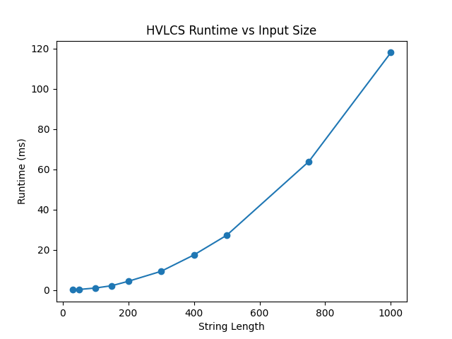

# Max Subsequence (HVLCS)

## Student Information
| Name | UFID |
|------|------|
| Stephen | 63144483 |

## Repository Structure
max-subsequence/
├── src/
│   ├── subsequence.py       
│   └── graph.py         
├── data/
│   ├── example1.in          
│   └── example1.out         
├── tests/
│   └── subsequenceTests.py  
└── README.md

## Dependencies
Python 3.8+
matplotlib (only needed for  graph)

pip install matplotlib

## Assumptions
- All characters in A and B appear in the alphabet block
- All character values are nonnegative integers
- Input file is located at `data/example1.in`
- Code is run from the root of the repository

## How to Run

### Run the algorithm
python3 src/subsequence.py

### Save output to file
python3 src/subsequence.py > data/example1.out

### Run unit tests
python3 tests/subsequenceTests.py

## Example
Input file: data/example1.in

3
a 2
b 4
c 5
aacb
caab

Output file: data/example1.out

9
cb

To reproduce:
python3 src/subsequence.py > data/example1.out

## Benchmark

To generate the runtime graph run:
python3 src/graph.py

This will print a runtime table to the terminal and save the graph to:
data/runtime_chart.png

## Question 1 - Empirical Runtime Comparison

Run the benchmark script to generate the runtime graph:
```
python3 src/graph.py
```
The graph is saved to data/runtime_chart.png and shows quadratic growth
consistent with the O(nm) theoretical bound.



## Question 2 - Recurrence Equation

State definition:
Let dp[i][j] be the maximum value achievable by a common subsequence of stringA[1..i] and stringB[1..j].

Base cases:
```
dp[0][j] = 0   for all j = 0, 1, ..., m
dp[i][0] = 0   for all i = 0, 1, ..., n
```
An empty prefix of either string has no characters to share, so the only
common subsequence is empty with value 0.

Recurrence (i >= 1, j >= 1):
```
if stringA[i] == stringB[j]:
    dp[i][j] = dp[i-1][j-1] + charVal(stringA[i])
else:
    dp[i][j] = max(dp[i-1][j], dp[i][j-1])
```

Why it is correct:

Case stringA[i] == stringB[j]:
Any common subsequence either uses this matching pair or it does not. If it
does, the remaining part is a common subsequence of stringA[1..i-1] and stringB[1..j-1],
giving at most dp[i-1][j-1] + charVal(stringA[i]). Since all character values are
nonnegative, including a match never decreases the total value, so taking
the match is always optimal.

Case stringA[i] != stringB[j]:
Both characters cannot occupy the same position in a common subsequence.
The optimal solution either excludes stringA[i] (value <= dp[i-1][j]) or excludes
stringB[j] (value <= dp[i][j-1]). Taking the maximum is optimal.

By induction over i + j, dp[n][m] equals the maximum value of any common
subsequence of stringA and stringB.

## Question 3 - Pseudocode and Big-Oh
```
HVLCS(stringA[1..n], stringB[1..m], charVal):

    for i = 0 to n:
        dp[i][0] = 0
    for j = 0 to m:
        dp[0][j] = 0

    for i = 1 to n:
        for j = 1 to m:
            if stringA[i] == stringB[j]:
                dp[i][j] = dp[i-1][j-1] + charVal(stringA[i])
            else:
                dp[i][j] = max(dp[i-1][j], dp[i][j-1])

    result = empty list
    i = n, j = m
    while i > 0 and j > 0:
        if stringA[i] == stringB[j]:
            prepend stringA[i] to result
            i = i - 1 
            j = j - 1
        else if dp[i-1][j] >= dp[i][j-1]:
            i = i - 1
        else:
            j = j - 1

    return dp[n][m], result
```

Runtime:

The runtime is O(nm) in all cases because every cell of the (n+1) x (m+1)
table is visited exactly once. Space is also O(nm) for the DP table.